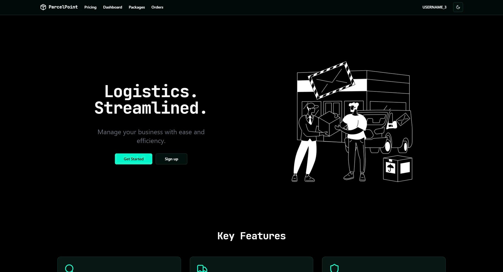
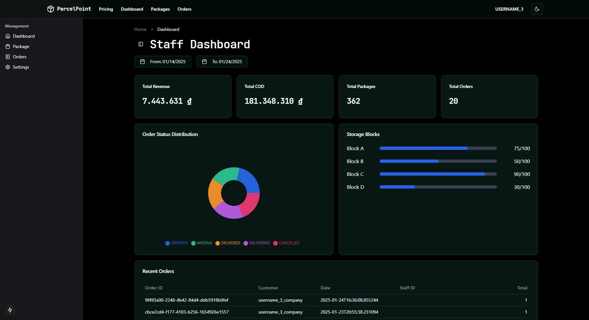

<span style="font-weight: 900; font-size:2.5em ; font-family: 'JetBrains Mono', Consolas;">ParcelPoint</span>

*under development*


## OwO What's this?

### ParcelPoint is a Parcel management and Inventory tracking website.

This is a small web app for one of my school projects. You are a merchant you have a package
that you want to delivery to your customer, just pop in an order and let the 
professionals handle the rest.

### This site is using Next.js, FastAPI and PostgreSQL

You heard it.

### Installation

Navigate to the root folder and install all dependencies in `requirements.txt`

```shell
  pip install requirements.txt
```
Fill in environment variables, it should look something like this
```aiignore
PORT=
DB_USER=
DB_PASSWORD=
DB_NAME=
JWT_SECRET=
DATABASE_URL=
TEST_DATABASE_URL=
ENV=
```
Some are unused though, since it's just me doing all of this and i'm tired, so better safe than sorry.
Make sure that you have a PostgresSQL database that is running. Should be something `parcelpoint.public` to match the code.

Navigate to the `frontend/` folder, and install all dependencies

```aiignore
 pnpm install
```
Also create an `frontend/.env` that include these:
```aiignore
NEXT_PUBLIC_BACKEND_URL=
BACKEND_URL=
```
Now running the local dev site, and you're good to go!
```shell
pnpm run dev
```

Replace `pnpm` with `npm` or `yarn` if you prefer those.

When your database is brand new. You can navigate to `seedings/__init__.py` and run some code
to have fake data to work with, the code is a mess, it's just to get started though.

### Charts! Charts! Charts!

I include a bunch of (kind of working) charts to make people convinced and feel smart (aren't we all?).
They should be customizable though.

### What about your ugly code mess?

Yeah... about that, uhh... lorem ipsum dolor sit amet?